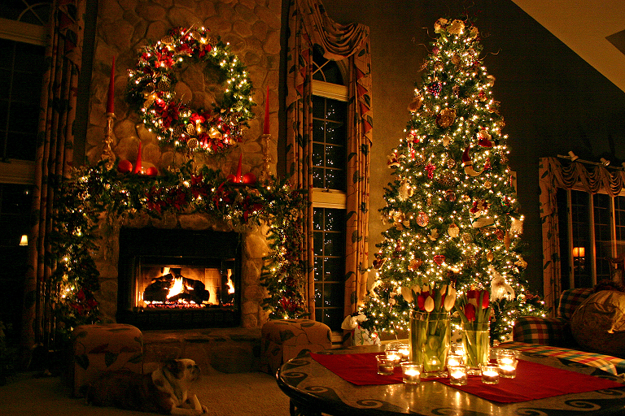
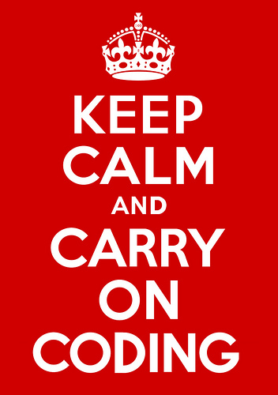
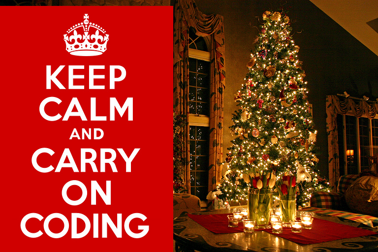
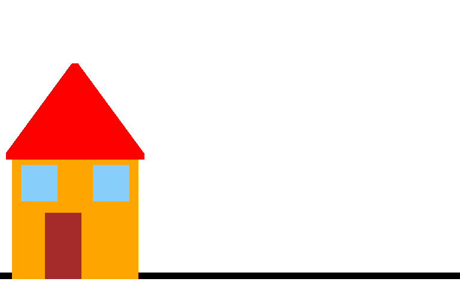
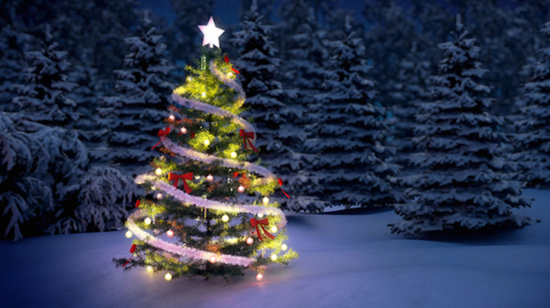
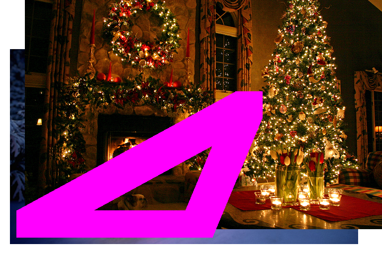

<div id="top"></div>

[![MIT License][license-shield]][license-url]


<!-- PROJECT LOGO -->
<br />
<div align="center">
  <a href="https://github.com/miron-boiangiu/image-processor">
    
  </a>

<h3 align="center">Image processor</h3>

  <p align="center">
    CLI image processor with drawing and image overlapping capabilities.
    <br />
    <br />
    <a href="https://github.com/miron-boiangiu/image-processor/issues">Report Bug</a>
    ·
    <a href="https://github.com/miron-boiangiu/image-processor/issues">Request Feature</a>
  </p>
</div>


<!-- TABLE OF CONTENTS -->
<details>
  <summary>Table of Contents</summary>
  <ol>
    <li>
      <a href="#about-the-project">About The Project</a>
      <ul>
        <li><a href="#built-with">Built With</a></li>
      </ul>
    </li>
    <li>
      <a href="#getting-started">Getting Started</a>
      <ul>
        <li><a href="#prerequisites">Prerequisites</a></li>
      </ul>
    </li>
    <li><a href="#usage">Usage</a></li>
    <li><a href="#license">License</a></li>
    <li><a href="#contact">Contact</a></li>
  </ol>
</details>


<!-- ABOUT THE PROJECT -->
## About The Project

A low-level BMP image processor, which allows the user to select a brush color, a brush size, draw lines and shapes, fill in gaps, overlap pictures, edit an already existing image and save his work.   
<br>
<a href="https://ocw.cs.pub.ro/courses/programare/teme_2021/tema3_2021_cbd">Assignment link.</a>

<p align="right">(<a href="#top">back to top</a>)</p>


### Built With

* [C](http://www.open-std.org/jtc1/sc22/wg14/)

<p align="right">(<a href="#top">back to top</a>)</p>


<!-- GETTING STARTED -->
## Getting Started


### Prerequisites

* make & gcc
  ```sh
  sudo apt-get install build-essential
  ```

### Compilation

1. Simply use the makefile included in order to compile the program.
   ```sh
   make
   ```
2. You can then run the program by running ./bmp.
   ```sh
   ./bmp
   ```

<p align="right">(<a href="#top">back to top</a>)</p>


<!-- USAGE EXAMPLES -->
## Usage
Here is a quick rundown of all the commands:  
<br>
**Warning!** all of the **x** and **y** values are interpreted according to how the image is seen once it has been opened, which is upside-down (vertically inverted), keep that in mind!  
<br>
The user must first open a picture.
```
edit <path>
```
The picture with the edits can be saved to another location.  
```
save <path>
```
Another image can overlap the one that is open.  
```
insert <path> x y

x→ the width coordinate where the image gets overlapped.
y→ the height coordinate where the image gets overlapped.
```
The brush's color can be changed.
```
set draw_color R G B

R→ the redness of the brush, from 0 to 255.
G→ the greenness of the brush, from 0 to 255.
B→ the blueness of the brush, from 0 to 255.
```
The brush's width can be changed.
```
set line_width x

x→ the thickness of the brush, an odd number of pixels.
```
Draw a straight line between two points.
```
draw line x1 y1 x2 y2

x1→ the width coordinate of the first pixel.
y1→ the height coordinate of the first pixel.
x1→ the width coordinate of the second pixel.
y1→ the height coordinate of the second pixel.
```
Draw a rectangle.
```
draw rectangle x y width height

x1→ the width coordinate of the first pixel.
y1→ the height coordinate of the first pixel.
width→ the width of the rectangle, in pixels.
height→ the height of the rectangle, in pixels.
```
Draw a triangle.
```
draw triangle x1 y1 x2 y2 x3 y3

x1→ the width coordinate of the first pixel.
y1→ the height coordinate of the first pixel.
x2→ the width coordinate of the second pixel.
y2→ the height coordinate of the second pixel.
x3→ the width coordinate of the third pixel.
y3→ the height coordinate of the third pixel.
```
Fill an area with color.
```
fill x y

x→ the width coordinate of the area to be filled.
y→ the height coordinate of the area to be filled.
```
Quit the program.
```
quit
```
#### Example of usage:  

- Let's say we start with this picture:  

  
And we wish to place this picture on top of it:  
<br>

  
Then, we would run the next set of commands:  
<br>

```
edit images/christmas.bmp
insert images/kalm.bmp 0 0
save output/Task2/output0.bmp
quit
```
And the end result would be:  
  
<br>

- Now let's say we wish to draw a house. Well, starting from a blank image:  

  
And by running the following set of commands:  

```
edit images/blank.bmp
set draw_color 0 0 0
set line_width 11
draw line 0 50 768 50
set draw_color 255 165 0
draw rectangle 25 50 200 200
fill 85 60
set draw_color 165 42 42
draw rectangle 80 50 50 100
fill 90 60
set draw_color 135 206 250
draw rectangle 40 180 50 50
fill 50 190
set draw_color 135 206 250
draw rectangle 160 180 50 50
fill 170 190
set draw_color 255 0 0
draw triangle 15 250 235 250 125 400
fill 55 260
save output/Task5/output1.bmp
quit
```
We get:  
  
<br>

- As a last example, let's say we start from a blank picture once again:  
  
And we wish to overlap the next pictures:   
  
  
And then we wish to draw a triangle on top of the resulting picture.  
Well, by running the commands:  

```
edit images/blank.bmp
set draw_color 0 0 255
insert images/tree.bmp 20 20
insert images/christmas.bmp 50 50
set line_width 55
draw triangle 60 60 400 60 500 300
set draw_color 255 0 255
fill 60 60
save output/Task5/output4.bmp
quit
```
We get:  
  
<p align="right">(<a href="#top">back to top</a>)</p>


<!-- LICENSE -->
## License

Distributed under the MIT License. See `LICENSE.txt` for more information.

<p align="right">(<a href="#top">back to top</a>)</p>


<!-- CONTACT -->
## Contact

Boiangiu Victor-Miron - miron.boiangiu@gmail.com

Project Link: [https://github.com/miron-boiangiu/image-processor](https://github.com/miron-boiangiu/image-processor)

<p align="right">(<a href="#top">back to top</a>)</p>


<!-- MARKDOWN LINKS & IMAGES -->
<!-- https://www.markdownguide.org/basic-syntax/#reference-style-links -->
[contributors-shield]: https://img.shields.io/github/contributors/github_username/repo_name.svg?style=for-the-badge
[contributors-url]:https://github.com/miron-boiangiu/image-processor/graphs/contributors
[forks-shield]: https://img.shields.io/github/forks/github_username/repo_name.svg?style=for-the-badge
[forks-url]:https://github.com/miron-boiangiu/image-processor/network/members
[stars-shield]: https://img.shields.io/github/stars/github_username/repo_name.svg?style=for-the-badge
[stars-url]:https://github.com/miron-boiangiu/image-processor/stargazers
[issues-shield]: https://img.shields.io/github/issues/github_username/repo_name.svg?style=for-the-badge
[issues-url]:https://github.com/miron-boiangiu/image-processor/issues
[license-shield]: https://img.shields.io/github/license/miron-boiangiu/image-processor.svg?style=for-the-badge
[license-url]:https://github.com/miron-boiangiu/image-processor/blob/master/LICENSE
[linkedin-shield]: https://img.shields.io/badge/-LinkedIn-black.svg?style=for-the-badge&logo=linkedin&colorB=555
[linkedin-url]: https://linkedin.com/in/linkedin_username
[product-screenshot]: images/screenshot.png
